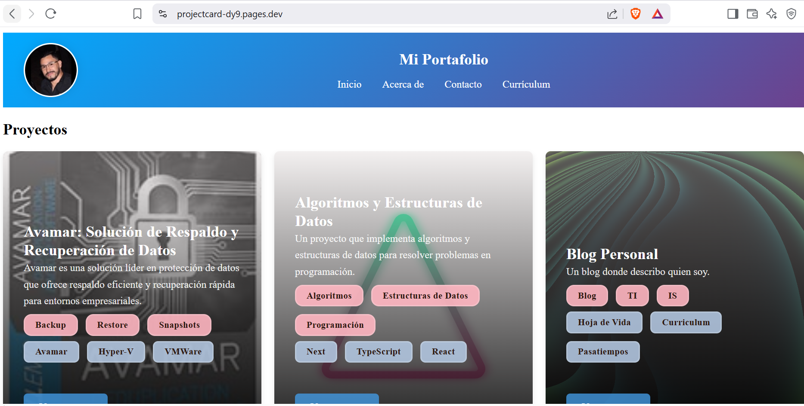

# 🧠 Portafolio de Proyecto - Sistemas Expertos

Este repositorio forma parte de mi portafolio personal y presenta un proyecto de **Sistemas Expertos** desarrollado como parte de mis estudios en Ingeniería en Sistemas. El sistema tiene como objetivo simular el razonamiento de un experto para brindar recomendaciones y tomar decisiones dentro de un dominio específico.

## 📌 Descripción del Proyecto

El sistema experto fue diseñado para **[(https://projectcard-dy9.pages.dev, por ejemplo: proyectos, blogs, portafolio, curriculum u hoja de vida, entre otros.]**. Utiliza una base de conocimientos y un motor de inferencia para proporcionar respuestas lógicas en función de las reglas establecidas.

## 🚀 Funcionalidades

- ✅ Interfaz amigable para el usuario
- 📚 Base de conocimientos editable
- 🔍 Razonamiento lógico basado en reglas
- 🧩 Motor de inferencia hacia adelante y/o hacia atrás
- 📝 Explicación del razonamiento del sistema

## 🛠️ Tecnologías Utilizadas

- Lenguaje: **[Next.js/ Astro / TypeScript]**
- Frameworks: **[Ejemplo: TailWinds, Markdown]**
- Herramientas: **[CloudFlare, VSCode]**
- Otros: **[Ejemplo: HTML, CSS, JSON, etc.]**

## 📂 Estructura del Proyecto

📂 mi-portafolio/
├── 📂 public/          # Archivos estáticos (imágenes, fuentes, favicon, etc.)
│   ├── 📂 images/      # Imágenes accesibles
│   │   ├── Abstractgris.jpeg
│   │   ├── AbstractNegro.png
│   ├── nnneon.svg      # Imagen de fondo
│   ├── favicon.ico
│   ├── HOJA DE VIDA SERGIO GARAY.pdf
│
├── 📂 src/             # Código fuente del sitio
│   ├── 📂 assets/
│   │   ├── astro.svg
│   │   └── background.svg
│   ├── 📂 components/  # Componentes reutilizables (Astro)
│   │   ├── Footer.astro
│   │   ├── Header.astro
│   │   ├── NavBar.astro
│   │   ├── ProfileImage.astro
│   │   ├── ProjectCard.astro
│   │   └── Welcome.astro
│   │
│   ├── 📂 content/     # contenido markdown
│   │   ├── 📂 projects/    #proyectos markdown
│   │   │   ├── algoritmos.mdx
│   │   │   ├── avamar.mdx
│   │   │   ├── blog.mdx
│   │   │   ├── compilador.mdx
│   │   │   ├── portafolio.mdx
│   │   │   └── terraform.mdx
│   │
│   ├── 📂 layouts/     # Plantillas para páginas (estructura base)
│   │   └── Layout.astro
│   │
│   ├── 📂 pages/       # Páginas del sitio (cada archivo aquí es una URL)
│   │   ├── 📂 projects/
│   │   │   └── [slug].astro
│   │   ├── 404.astro # Error 404
│   │   ├── about.astro # Página "Acerca de" → http://localhost:4321/about
│   │   ├── contacts.astro # Página "Contacto" → http://localhost:4321/contacts
│   │   └── index.astro # Página principal → http://localhost:4321/
│   │
│   ├── 📂 styles/      # Estilos CSS globales o específicos
│   │   ├── contacts.css
│   │   ├── navbar.css
│   │   ├── header.css
│   │   ├── navbar.css
│   │   ├── project.css
│   │   └── styles.css
│   │
│   ├── 📂 images/      # (Opcional) Imágenes procesadas por Astro
│   │
│   ├── 📂 data/        # Datos en JSON o JavaScript para alimentar la web (opcional)
│   │   ├── data.json
│
├── 📂 node_modules/    # Dependencias instaladas con npm/yarn/pnpm
│
├── astro.config.mjs    # Configuración de Astro
├── package.json        # Dependencias y scripts npm
├── package-lock.json
├── README.md           # Información del proyecto
└── tsconfig.json       # Configuración de TypeScript (si usas TS)


## ⚙️ Cómo Ejecutarlo

1. Clona este repositorio:
   ```bash
   git clone https://github.com/SergioGaray13/ProjectCard.git
   cd sistema-experto
   echo "# ProjectCard" >> README.md
    git init
    git add README.md
    git commit -m "Portafolio"
    git branch -M main
    git remote add origin https://github.com/SergioGaray13/ProjectCard.git
    git add .
    git push -u origin main

📸 Proyecto en Producción



🎓 Créditos

Proyecto realizado por Sergio Garay Ingeniero en Sistemas como parte del curso de Sistemas Expertos de la carrera de Ingeniería en Sistemas.

📬 Contacto

Si tienes preguntas o deseas colaborar, puedes contactarme a través de:

Correo: [sergio7garay@gmail.com]

LinkedIn: [linkedin.com/in/tuusuario]

Portafolio completo: [https://projectcard-dy9.pages.dev]

© 2025 Sergio Garay. Todos los derechos reservados.
